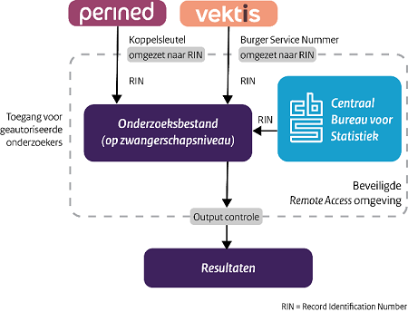

# DIAPER: Data-InfrAstructure for ParEnts and ChildRen

De Data-InfrAstructure for ParEnts and ChildRen, DIAPER is geschikt voor onderzoek rondom geboortezorg, zwangerschap en bevalling, en de eerste jaren van het leven. 

## Data-infrastructuur
In DIAPER staan declaratiegegevens van zorgverzekeraars over zwangerschap, bevalling en kraamperiode (Vektis), gegevens over de kwaliteit van zorg en gezondheidsuitkomsten van zwangere vrouwen en pasgeborenen (Perined). Ook is er achtergrondinformatie (beschikbaar via CBS microdata) te vinden van moeder, vader en kind waaronder leeftijd, land van herkomst, huishoudinkomen, schulden, gezinssamenstelling, opleidingsniveau en afstand tot dichtstbijzijnde zorgverleners.
De DIAPER data-infrastructuur koppelt de databestanden van de verschillende bronnen aan elkaar in de Remote Access omgeving van CBS waar de gegevens veilig worden opgeslagen, gekoppeld en geanalyseerd.

In het artikel [Observational Data for Integrated Maternity Care: Experiences with a Data-Infrastructure for Parents and Children in the Netherlands (externe link) (in English)](https://ijic.org/articles/10.5334/ijic.7012) wordt een uitgebreide beschrijving gegeven van de data-infrastructuur DIAPER.

## Zwangerschap en geboorte monitors
Het RIVM gebruikt DIAPER voor verschillende monitors:

- [ ] [Landelijke Monitor Kansrijke Start](https://www.rivm.nl/monitoren-zwangerschap-en-geboorte/kansrijke-start/landelijke-monitor) 
- [ ] [Lerende Lokale Monitor Kansrijke Start](https://www.rivm.nl/monitoren-zwangerschap-en-geboorte/kansrijke-start/lerende-lokale-monitor)
- [ ] [Onbedoelde zwangerschappen](https://www.rivm.nl/monitoren-zwangerschap-en-geboorte/onbedoelde-zwangerschappen)
- [ ] [Passende bekostiging van de geboortezorg](https://www.rivm.nl/monitoren-zwangerschap-en-geboorte/passende-bekostiging-geboortezorg) 

[Monitoren zwangerschap en geboorte](https://www.rivm.nl/monitoren-zwangerschap-en-geboorte) geeft een overzicht van de verschillende (actie)programma’s van het ministerie van VWS (Ministerie van Volksgezondheid, Welzijn en Sport) die te maken hebben met zwangerschap en geboorte en waarbij DIAPER een cruciale rol speelt in de data analyses.

## Verdiepende onderzoeken
De data-infrastruktuur van DIAPER wordt ook gebruik voor de analyses in verdiepende onderzoeken. 
[Hier](https://www.rivm.nl/monitoren-zwangerschap-en-geboorte/wetenschappelijke-publicaties) vind je een lijst met wetenschappelijke publicaties gerelateerd aan DIAPER.

## Beschikbaarheid code
In deze repository wordt de code gedeeld van de volgende monitoren:
- [ ] [Landelijke Monitor Kansrijke Start 2023](Landelijke%20Monitor%20Kansrijke%20Start)

De scripts en de data van de volgende papers zijn [hier](Papers) te vinden:
- [ ] [Stakeholder perspectives on payment reform in maternity care in the Netherlands: A Q-methodology study](Papers/stakeholder_perspectives_on_payment_reform_in_maternity_care_in_the_netherlands_a_q-methodology_study) 
by [Zoë T.M. Scheefhals](https://orcid.org/0000-0001-6404-9936), [Eline F. de Vries](https://orcid.org/0000-0002-1336-4327), [Jeroen N. Struijs](https://orcid.org/0000-0002-7493-6720), [Mattijs E. Numans](https://orcid.org/0000-0002-0368-5426), [Job van Exel](https://orcid.org/0000-0002-4178-1777)

## Getting the data
In DIAPER zijn meerdere datasets van verschillende databronnen gekoppeld. De meeste datasets zijn niet open access en worden niet via deze repository gedeeld. Toegang tot deze datasets moet apart aangevraagd worden.

### Perined
"Perined heeft tot doel om de kwaliteit van de perinatale zorgverlening in Nederland te vergroten door samen te kijken hoe het beter kan. In Perined werken samen de beroepsorganisaties, die zich bezighouden met de geboortezorg: KNOV (Koninklijke Nederlandse Organisatie van Verloskundigen), LHV (Landelijke Huisartsen Vereniging) waaronder ook de verloskundig actieve huisartsen (verenigd in de VVAH), NVOG (Nederlandse Vereniging voor Obstetrie en Gynaecologie), NVK (Nederlandse Vereniging voor Kindergeneeskunde) en NVVP (Nederlandse Vereniging voor Pathologie)." [Perined organisatie](https://www.perined.nl/over-perined/organisatie)

"De gegevens uit de perinatale registratie en perinatale audit kunnen gebruikt worden voor wetenschappelijk onderzoek. Voor ieder onderzoek – ook door bestaande consortia of eigen Perined-medewerkers – is een gegevensaanvraag nodig." Voor meer informatie zie [Perined gegevensaanvragen](https://www.perined.nl/onderwerpen/onderzoek/gegevensaanvragen)

### CBS microdata
"Microdata zijn koppelbare data op persoons-, bedrijfs- en adresniveau waarmee Nederlandse universiteiten, wetenschappelijke organisaties, planbureaus en onderzoeksinstanties in een aantal andere EU-landen onder strikte voorwaarden zelf statistisch onderzoek kunnen doen. Het borgen van privacy en het voorkomen van onthulling van personen of bedrijven is daarbij het uitgangspunt. Het onderzoek wordt gedaan in een beveiligde microdata-omgeving van het CBS, de Remote-Access-omgeving (RA-omgeving)." Voor meer informatie zie [Microdata: Zelf onderzoek doen](https://www.cbs.nl/nl-nl/onze-diensten/maatwerk-en-microdata/microdata-zelf-onderzoek-doen).
 
### Vektis
"Met heldere inzichten draagt Vektis bij aan goede zorg in Nederland. Onze unieke database geeft inzicht in alle door zorgverzekeraars betaalde zorgkosten binnen de Zorgverzekeringswet. Op basis van deze data doen wij onderzoek en bieden wij inzichten aan partijen in de zorg. Voor partijen die zelf onderzoek willen doen, stellen wij ook open databestanden beschikbaar." Voor meer informatie zie [Open data over de zorg](https://www.vektis.nl/open-data).

## Setting up the environment
Alle analyses zijn gedaan in R met verschillende packages. Om de R omgeving op te zetten en de R code te kunnen runnen, moeten de volgende packages geinstalleerd zijn:

- R
- RStudio
- R Packages: haven, data.table, stringr, tidyverse, labelled, readxl, purrr

## License
All source code is made available under a European Union Public Licence v1.2 license. You can freely use and modify the code, without warranty, so long as you provide attribution to the authors. See [license](license.md) for the full license text.
